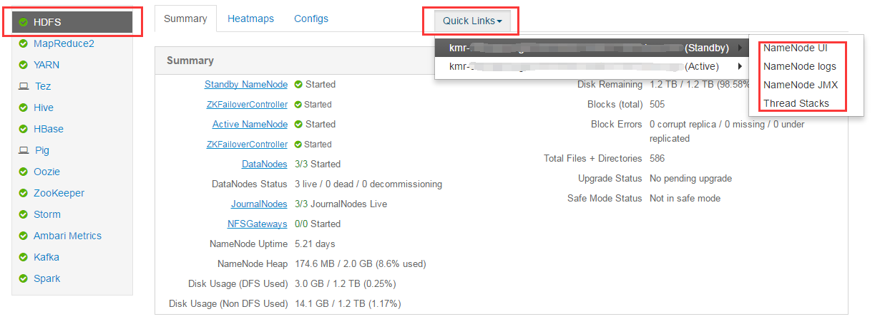
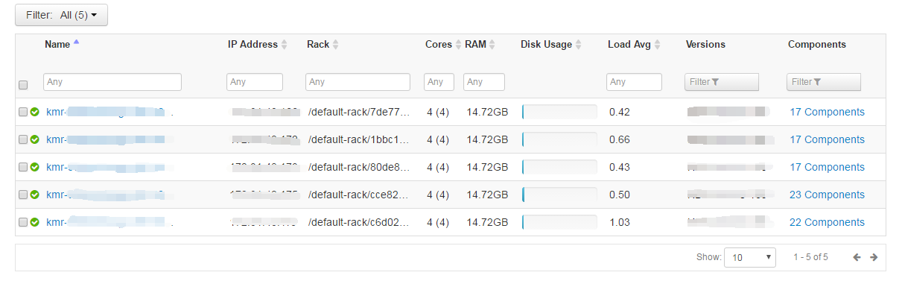

## Ambari

Apache Ambari是一种基于Web的工具，支持Hadoop集群的供应、监控和管理。Ambari支持HDFS、MapRedue、Hive、SPark、Storm、Pig、Hbase、Zookeeper等的集中管理，也是5个顶级Hadoop管理工具之一。

更多资料参见 [Apache Ambari](http://ambari.apache.org/) 官网

KMR对Ambari对了权限控制，暂时只开放只读权限，您可以查看集群的监控和配置信息，不支持更改配置。

### 准备

---

您已成功创建一个常驻集群，登录控制台，进入集群详情页面，通过管理工具进入“Ambari控制台”，用户名和密码均为“kmr"，登录成功后，即进入Ambari页面。

Ambari Dashboard页面展示了集群的整体情况，可以点击各个图表查看具体信息

### 服务级别的监控管理

---

服务级别监控管理包括对HDFS,MapReduce，Storm,Spark等的管理，通过左边导航点击对应的服务，可以查看该服务的使用情况。

“Summary” 展示了服务的基本情况和使用图标，也可以通过 “+” 选择需要显示的指标

“Heatmaps” 展示了服务各个角色使用磁盘IO、网卡IO、CPU以及JVM等性能状况

“Configes” 展示了服务的配置信息

点击服务详情页面的“Quick Links”可查看集群应用的原生监控工具

### 机器级别的监控管理

---

点击上方导航栏的“Hosts”按钮，可以查看Ambari所管理的机器列表,通过输入过滤规则，可以筛选机器。

### 模块级别的监控管理

---

通过机器列表，点击进入具体的机器，查看机器详情，对该机器的服务角色进行监控管理，根据上方页签，可查看概览，配置，警告和版本信息。

### 警告管理

---

