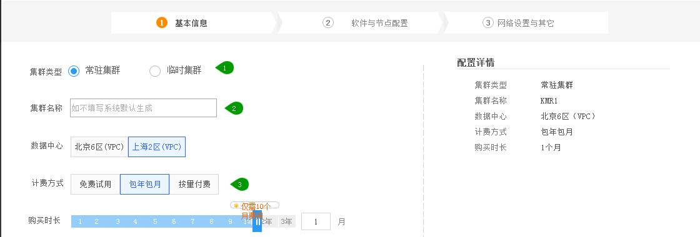

## 集群创建

　　KMR的某些功能依赖于KS3，在创建集群之前，请确认您已经开通KMR和KS3服务，并已经创建AccessKey/SecretKey 参阅KS3官方文档 [创建密钥](http://www.ksyun.com/doc/art/id/612)

　　如需使用KS3存放原始数据，参阅 [数据导入](shu_ju_dao_ru_zhi_nan.md)
  
　　KMR提供了临时集群和常驻集群两种类型，临时集群在作业执行完毕后会自动释放，适合批量数据计算；常驻集群提供了更高的可用性，集成了更丰富的Hadoop生态组件，适合流计算、实时数据查询或者较为复杂的数据分析场景。不同类型集群的创建步骤略有不同
  

###   创建步骤

　　1.登录金山云控制台，选择数据分析->托管Hadoop

　　2.选择“集群管理”,点击“新建集群”按钮，进入集群创建向导

　　3.填写以下内容完成集群创建：
  
   　　[基本信息](#ji_qun_ji_ben_xin_xi)

   　　[软件与节点配置](#Software_And_Node)

   　　[网络设置与其他](#tian_jia_zuo_ye)

   　　[引导与作业设置（仅临时集群）](#que_ren_ding_dan)
     
　　  
  <h3 name="ji_qun_ji_ben_xin_xi" id="ji_qun_ji_ben_xin_xi">基本信息</h3>
  

---

**集群类型** ：KMR提供临时集群和常驻集群两种类型，临时集群在作业执行完毕后会自动释放，适合批量数据计算；常驻集群提供了更高的可用性，集成了更丰富的Hadoop生态组件，适合流计算、实时数据查询或者较为复杂的数据分析场景。

**集群名称** ：创建集群时，会根据系统时间戳生成一个默认名称。您也可以为KMR集群输入描述性名称。长度限制为1-25个字符,支持数字、字母、特殊符号（_和-）该名称不必是唯一的。

**数据中心** ：选择KMR集群所在数据中心。（如果需要使用KS3存储数据，应确保KMR与KS3 bucket 处于同一区域）

**计费方式** ：KMR计费方式根据不同的集群类型有所区别：常驻集群可选择按需计费和包年包月两种计费方式；临时集群仅可选择按需计费方式。详见 [KMR产品定价与选购](chan_pin_ding_jia_yu_xuan_gou.md)

　　

  <h3 name="Software_And_Node" id="Software_And_Node">软件与节点配置</h3>
  
  
---

**产品版本** ：选择创建KMR集群所用的产品版本，选择不同版本可提供不同的集群基础配置和应用组件 

**应用程序** ：选择KMR集群中需要安装的Hadoop周边生态应用。对于常驻集群，可以将一些特殊的应用（如Kafka）部署到独立的节点组中 

 **用户配额** ：开通KMR服务时，会为每个账户分配一个资源配额，如果账户中使用的集群资源超过了该配额，则无法创建集群。如有特殊需求，请联系您的客户经理 
 
 **主节点** ：主要用于集群管理，并将计算程序和原始数据集分配到核心实例。此外，它还会跟踪每个计算作业的执行状态，监控实例的运行状况。KMR主节点与Hadoop系统的主节点相对应。临时集群集群只有一个主节点，常驻集群具有主、备两个主节点。 

 **核心节点** ：主要用于执行各项集群计算作业，同时作为hadoop分布式文件系统的数据节点存储数据。KMR核心节点与Hadoop系统的slave节点相对应。 

**任务节点** ：只用于执行各项集群计算作业,不作为分布式文件系统(HDFS)的数据存储节点，一个KMR集群可以有0至多个任务节点 

**节点配置** ：可根据实际的业务需求选择集群节点数量和类型，详见 [KMR产品定价与选购](chan_pin_ding_jia_yu_xuan_gou.md) 

　　

  <h3 name="Software_And_Node" id="Software_And_Node">软件与节点配置</h3>
  
  
---

